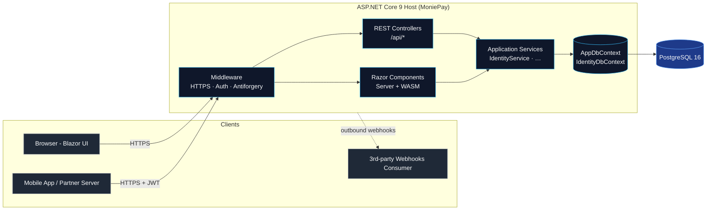
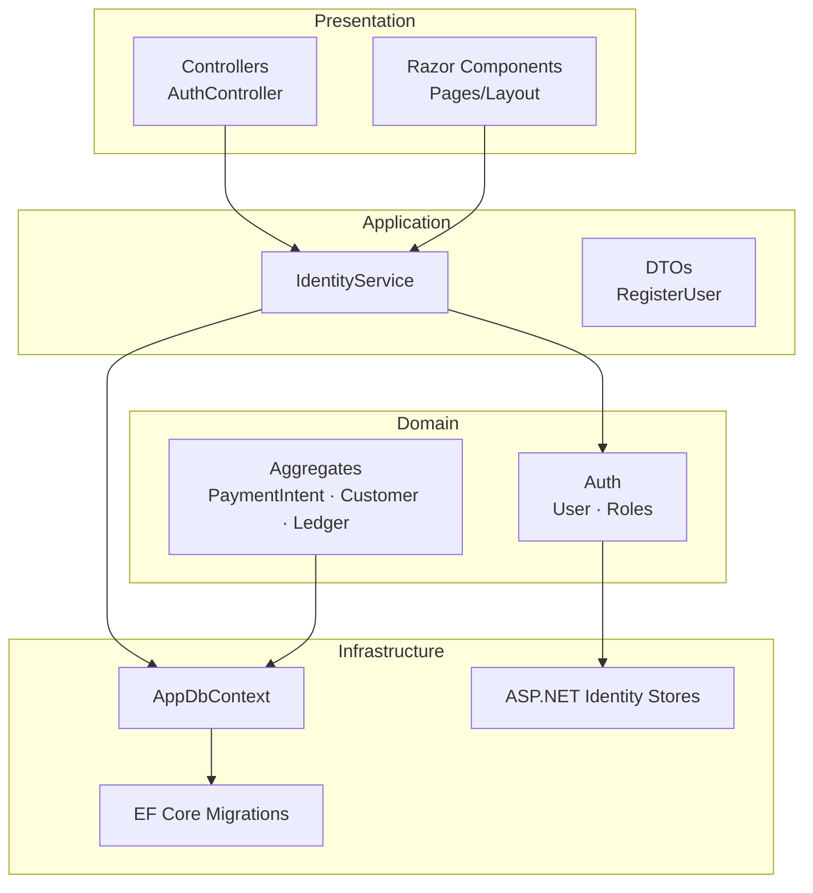
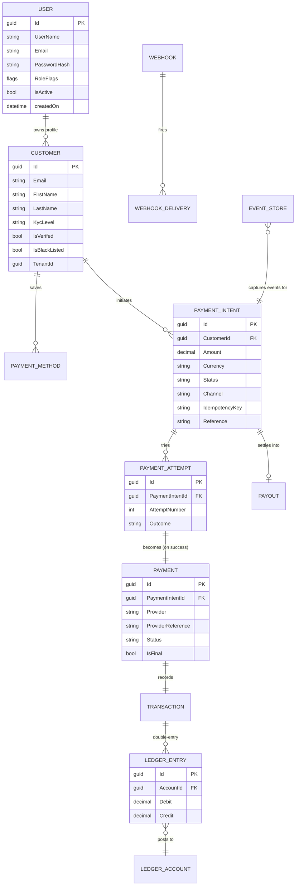
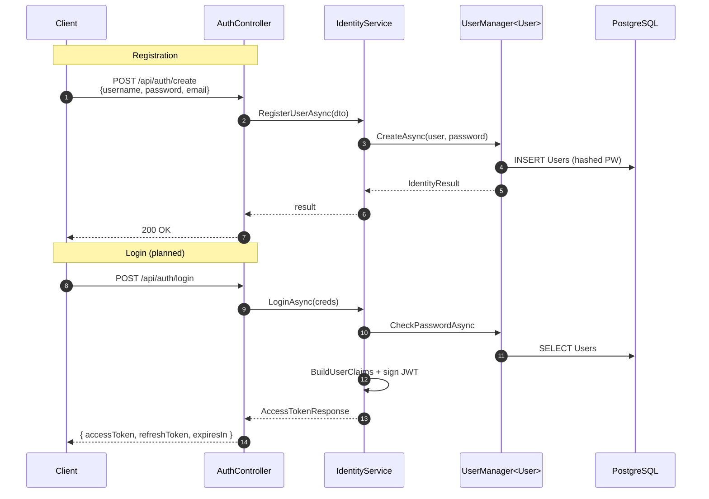
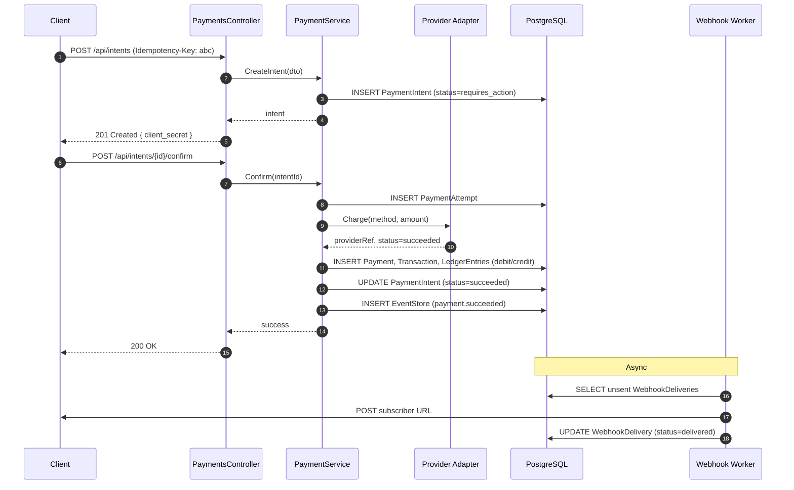

# MoniePay — Architecture

This document describes how MoniePay is put together: the runtime topology, the domain model, request flow, and the design decisions behind each piece. It is intentionally aimed at engineers evaluating the codebase — every diagram is rendered by GitHub natively.

---

## 1. Runtime Topology

MoniePay is a **single ASP.NET Core 9 process** that hosts three surfaces from the same host:

1. A REST API (controllers under `/api/*`)
2. A Blazor United UI (Server + WebAssembly auto render modes)
3. OpenAPI / Swagger documentation



**Why a single host?** The MoniePay scope is small enough that splitting API and UI into separate deployables would add ceremony without benefit. The seams are already drawn at the *service* layer, so extracting later is a refactor — not a rewrite.

---

## 2. Layered Responsibilities



| Layer | Folder | Responsibility |
|---|---|---|
| **Presentation** | `src/controller/`, `Components/` | HTTP routing, render modes, model binding, validation. **Never** touches `DbContext` directly. |
| **Application** | `src/services/` | Use-case orchestration. Wraps `UserManager`, builds JWTs, enforces invariants. |
| **Domain** | `src/models/`, `src/auth/` | Pure entities. Constructors / value equality / business invariants live here. |
| **Infrastructure** | `src/data/`, `Migrations/` | `AppDbContext`, Identity store mapping, schema migration history. |

---

## 3. Domain Model

The domain is modeled after how real payment processors decompose a charge. **A single user-initiated purchase produces multiple persistent records**, each capturing a different concern.



### Why this shape?

- **Intent ≠ Charge.** A `PaymentIntent` is the *promise* to move money; the `Payment` is the realized event with the provider. Refunds, retries, and partial captures plug in cleanly because the intent persists across attempts.
- **Idempotency at the intent.** `IdempotencyKey` lives on `PaymentIntent` so a flaky client retrying `POST /intents` gets the same intent, not a duplicate charge.
- **Double-entry ledger.** Every state change posts paired debit/credit `LedgerEntries` against `LedgerAccounts`. Balances are derived, never stored — so they cannot drift.
- **EventStore as audit log.** A separate append-only stream means we can replay history, build read models, or hand a regulator a complete trail without joining 12 tables.

---

## 4. Authentication & Authorization



### Identity model

- `User : IdentityUser<Guid>` — uses `Guid` keys for distributed-friendly IDs.
- ASP.NET Identity tables are **renamed** in `AppDbContext.OnModelCreating`:
  - `AspNetUsers` → `Users`
  - `AspNetUserRoles` → `UserRoles`
  - `AspNetRoleClaims` → `RoleClaims` (etc.)
- The `User` class exposes lowercase JSON aliases (`username`, `email`, `userId`) marked `[NotMapped]` so the API contract is idiomatic JSON while the DB columns stay canonical Identity (`UserName`, `Email`, `Id`).

### Roles — flag enum, not table explosion

`Roles.RoleType` is a `[Flags]` enum. A user can carry `Admin | Finance | Support` as a single `int` column (`RoleFlags`) instead of three join-table rows. Bitwise checks (`HasFlag`) are O(1) and JWT-friendly.

```csharp
[Flags]
public enum RoleType {
    None = 0, Admin = 1, Customer = 2, Merchant = 4,
    Audit = 8, Finance = 16, Support = 32, CustomerRep = 64
}
```

ASP.NET Identity roles (`IdentityRole<Guid>`) are still wired in for cases where a role needs claims or hierarchy — both systems coexist.

---

## 5. Request Flow — A Sample Charge (Target Design)

This sequence describes the **intended** payment flow once the provider adapter and webhook worker land (see roadmap).



---

## 6. Persistence

- **Provider:** PostgreSQL via `Npgsql.EntityFrameworkCore.PostgreSQL`.
- **DbContext:** `AppDbContext : IdentityDbContext<User, IdentityRole<Guid>, Guid>` — single context, no bounded-context split (yet).
- **Migrations:** EF Core code-first, stored in `MoniePay/Migrations/`.
- **Pooling:** `AddDbContextPool<AppDbContext>` is used so the host reuses contexts under load.

### Naming conventions

| Concept | Convention |
|---|---|
| Tables | PascalCase plural (`Users`, `PaymentIntents`) |
| Identity tables | Renamed to drop the `AspNet` prefix |
| Keys | `Guid` everywhere — easier sharding, no leaked sequence info |
| Money | `decimal Amount` + `string Currency` (ISO 4217) — never `float`/`double` |
| Timestamps | `DateTime CreatedAt` / `UpdatedAt`, UTC |

---

## 7. Project Layout

```
MoniePay/                           Solution root
├── MoniePay/                       Server host
│   ├── Program.cs                  Composition root — DI, middleware, routes
│   ├── appsettings*.json           Connection strings, JWT secrets
│   ├── Components/                 Blazor Server pages, layout, routes
│   ├── Migrations/                 EF Core migration snapshots
│   └── src/
│       ├── auth/                   User, Roles (flag enum)
│       ├── controller/             AuthController (and future controllers)
│       ├── data/                   AppDbContext
│       ├── models/                 Domain entities
│       └── services/               IdentityService, RegisterUser DTO
├── MoniePay.Client/                Blazor WebAssembly project (auto render)
├── docs/                           This document and friends
└── MoniePay.sln
```

The `src/` subfolder grouping (`auth`, `controller`, `data`, `models`, `services`) is a feature-style layout — easier to find related files when working on one capability at a time, and a natural seam if any folder grows into its own project.

---

## 8. Design Decisions — Why It Looks Like This

| Decision | Alternative considered | Why we chose this |
|---|---|---|
| Single host (API + Blazor) | Separate API + SPA repos | Smaller cognitive load; seam exists at service layer so a split is mechanical later. |
| `Guid` primary keys | `bigint` sequences | Safer for distributed inserts; no sequence enumeration leak. |
| Flag-enum `RoleFlags` on user | Identity roles only | One row per user is enough for coarse RBAC; Identity roles remain for cases that need claims. |
| Rename Identity tables | Keep `AspNet*` prefix | Schema reads like a product schema, not a framework dump — helps reviewers and DBAs. |
| Double-entry ledger | Single `balance` column | Balances cannot drift; audits are mechanical; reversals are entries, not mutations. |
| `EventStore` table | CDC / external broker | Internal projection surface without adding Kafka/etc. for the demo scope. |
| EF Core migrations in repo | Schema diffing tools | Reviewable, replayable, branch-aware. |

---

## 9. Future Extension Points

- **Provider adapters.** An `IPaymentProvider` interface with `Stripe`/`Paystack`/`Mock` implementations would let `PaymentService` stay provider-agnostic.
- **Background workers.** `IHostedService` for webhook redelivery (exponential backoff) and reconciliation.
- **Read models.** Project `EventStore` into denormalized tables (or Postgres materialized views) for dashboards.
- **Multi-tenancy.** `Customer.TenantId` already exists; adding tenant filters to `AppDbContext.SaveChanges` would isolate data per merchant.
- **Outbox pattern.** Move outbound webhooks to an `Outbox` table written in the same transaction as the domain change, drained by the worker — guarantees at-least-once delivery without distributed transactions.
